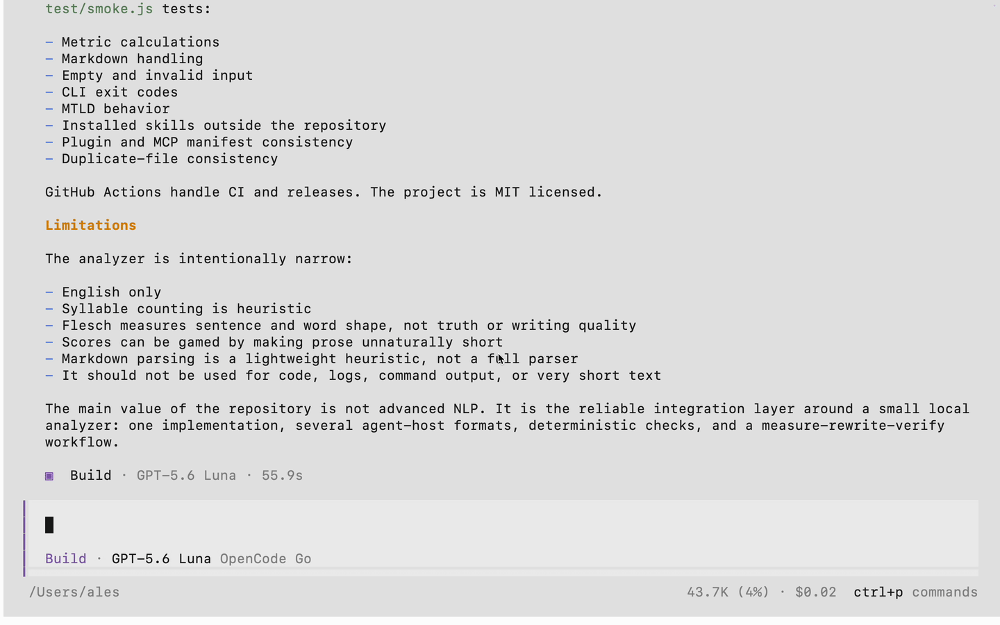

# Readability for Agents

[](https://github.com/alesdrobysh/readability-agents/actions/workflows/ci.yml)
[](https://github.com/alesdrobysh/readability-agents/releases)
[](LICENSE)

Readability helps Codex, OpenCode, Pi, OMP, Hermes, and Claude make English
prose easier to read. It runs a local **measure → rewrite → verify** loop. The
agent keeps the facts while it works toward your target score.

It works locally. You need no account, API key, telemetry, or network request.

> “Rewrite this release note in plain English. Keep every fact and aim for a
> Reading Ease score of at least 60.”

In Codex, invoke the skill directly:

```text
$readability Check `your-draft.md`. Keep every fact. Target Reading Ease 60.
```



This recording comes from a real OpenCode session. It shows the skill call, the
local analyzer, the rewrite, and the final Reading Ease score.

## Why use a skill instead of just prompting an agent?

An agent can rewrite prose when you ask. But “make this clearer” has no clear
stopping point. Readability adds a local score. The agent keeps rewriting until
the draft meets your target or another rewrite would hurt the meaning.

Use it for:

- READMEs and product documentation
- Release notes and changelogs
- PR descriptions and commit bodies
- Technical explanations for a broader audience

It reports these values:

- Flesch Reading Ease: 0-100, higher is easier
- MTLD and type-token ratio for word variety
- Sentence, paragraph, and word counts
- Local processing with no telemetry or network requests
- A pure JavaScript analyzer with no runtime dependencies

## Install

Install the reusable skill from [`skills/readability`](skills/readability/SKILL.md).
It includes a Node.js CLI and needs Node.js 18 or newer on `PATH`. Keep the
whole `readability` folder so `SKILL.md`, `package.json`, and `scripts/` stay
together. It has no runtime dependencies and needs no API key.

### Codex

From a checkout, copy the skill to Codex's user skill directory:

```bash
mkdir -p ~/.agents/skills/readability
cp -R skills/readability/. ~/.agents/skills/readability/
```

Codex also recognizes the portable [`plugin.json`](plugin.json) and
[`skills/`](skills/) layout when you add this repository as a plugin source.
The `.codex-plugin/plugin.json` file supports older Codex plugin loaders.
Invoke the skill as `$readability`, or ask Codex to check or simplify
long English prose.

### OpenCode

From a checkout:

```bash
mkdir -p ~/.config/opencode/skills/readability
cp -R skills/readability/. ~/.config/opencode/skills/readability/
```

You can also copy it to `.opencode/skills/readability` in a project. Invoke it
through OpenCode's `skill` tool or ask for a readability check.

### Pi

Install this repository as a Pi package. Pi discovers the root `skills/`
directory:

```bash
pi install git:github.com/alesdrobysh/readability-agents
```

For a project-only install, use `pi install --local` with the same source.
Invoke `/skill:readability` or ask Pi to simplify English prose.

### OMP (Oh My Pi)

Install the package so OMP can load its bundled skill:

```bash
omp plugin install https://github.com/alesdrobysh/readability-agents
```

From a checkout:

```bash
mkdir -p ~/.omp/agent/skills/readability
cp -R skills/readability/. ~/.omp/agent/skills/readability/
```

For a project-only install, copy the folder to `.omp/skills/readability`.
Invoke `/skill:readability` or ask OMP for a readability check.

### Hermes Agent

Hermes can install the skill and its scripts directly from GitHub:

```bash
hermes skills install alesdrobysh/readability-agents/skills/readability
```

For a project-only install, copy the folder to `.agents/skills/readability` and
trust that project with `hermes skills trust`. Invoke `/readability` or ask
Hermes to check prose.

### Other Agent Skills hosts

Copy `skills/readability` into the host's skill directory. It follows the
standard `SKILL.md` layout and reads no host-specific environment variables. If
the host cannot run Node.js, use the CLI from a checkout or use an MCP server
that exposes the analyzer.

### Claude Code plugin

Run these commands inside Claude Code:

```text
/plugin marketplace add alesdrobysh/readability-agents
/plugin install readability@readability-marketplace
```

Invoke `/readability`, or ask Claude to check or simplify long English
prose. The Claude Code plugin includes the same skill as `skills/`.

### Claude Desktop MCP Bundle

Download `readability.mcpb` from the [latest release](https://github.com/alesdrobysh/readability-agents/releases/latest).
Open it in Claude Desktop and approve the installation. The
`analyze_readability` MCP tool is then available.

The bundle includes its Node dependencies. It needs no API key or setup. The
server needs Node.js 20 or newer on the host.

### Command line

Run these commands from a checkout:

```bash
printf '%s\n' 'Your draft goes here.' | node src/check.js
printf '%s\n' 'Your draft goes here.' | node src/check.js --threshold 60
```

The threshold command exits 1 when the draft misses the target. Invalid input
or options exit 2.

### Documentation quality gate

Use a threshold in scripts or CI. The command exits 1 when prose misses the
target. This lets you block an unreadable draft before it ships.

```bash
node src/check.js --threshold 60 < README.md
```

## Example output

```json
{
  "word_count": 174,
  "sentence_count": 12,
  "paragraph_count": 4,
  "avg_sentence_length": 14.5,
  "avg_word_length": 4.8,
  "ttr": 0.61,
  "mtld": 74.2,
  "flesch_reading_ease": 64.3,
  "complexity_label": "Moderate"
}
```

| Field | Meaning |
|---|---|
| `flesch_reading_ease` | 0-100. 70+ simple, 50-69 moderate, below 50 complex. |
| `complexity_label` | Group based on Reading Ease. |
| `mtld` | Word variety; `null` below 50 words. |
| `ttr` | Unique words divided by all words. |
| `avg_sentence_length` | Words per sentence. |
| `avg_word_length` | Characters per word. |
| `word_count`, `sentence_count`, `paragraph_count` | Surface statistics. |

The analyzer removes code blocks and inline code. It strips formatting markers.
It keeps prose, headings, links, and list text. This is a small Markdown
heuristic, not a complete parser.

## Limits of this score

This project supports English prose only. Its syllable counter uses a small
heuristic, not a dictionary. Flesch Reading Ease rewards short sentences and
short words. It cannot judge meaning, accuracy, tone, or style. Use the score as
a guardrail against bloat. Do not game the number.

Do not use it on source code, logs, command output, non-English prose, or tiny
samples.

## How it compares

| Approach | Agent can rewrite | Fixed score | Local check | Threshold exit |
|---|---:|---:|---:|---:|
| Ask an agent to “make it clearer” | Yes | No | — | No |
| Browser-based writing editor | Outside the agent | Usually | Varies | No |
| Traditional prose linter | No | Rule-based | Usually | Usually |
| **Readability** | **Yes** | **Yes** | **Yes** | **Yes** |

Readability does one job: make long English prose easier to read without losing
its meaning.

## Privacy and security

Analysis happens in the local Node process. The analyzer:

- makes no network requests;
- does not persist text (the agent host may retain conversation data);
- starts no network listener;
- uses no API keys or telemetry.

The MCP Bundle talks to its host over stdio. See
[SECURITY.md](SECURITY.md) to report a vulnerability.

## Development

```bash
npm install
npm test
npm run validate:mcpb
npm run build:mcpb
# -> readability.mcpb and readability.mcpb.sha256
```

`src/analyzer.js` and `src/check.js` are the source files. The build copies them
into the portable skill, Claude Code plugin, and MCP Bundle. The test suite
checks that the copies stay identical. It also runs the portable skill from an
installed copy outside this repository.

Project layout:

```text
src/                         analyzer and CLI source
skills/readability/          portable Agent Skill
plugin.json                  portable plugin manifest
.codex-plugin/               Codex compatibility manifest
plugin/                      Claude Code plugin
mcpb/                        Claude Desktop MCP Bundle source
test/smoke.js                dependency-free smoke tests
scripts/build-mcpb.sh        validated, lockfile-based bundle build
.claude-plugin/              self-hosted Claude Code marketplace
.github/workflows/           CI and release automation
```

See [CONTRIBUTING.md](CONTRIBUTING.md) for development and release checks.

## License

MIT. See [LICENSE](LICENSE).
